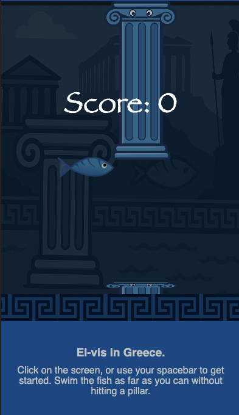

# 🐟 El-vis

A simple but addictive web game where you swim as far as possible without hitting the pillars.
Built with **HTML, CSS, JavaScript**, and a **PHP/MySQL backend** for highscores.

## 🚀 Features
- Canvas-based game (Flappy Bird-style)
- Save score in database
- Live highscore list
- Responsive layout
- Debug mode with hitbox visualization

## 📂 Project Structure
```
.
├── favicon/           # App icons and manifest
├── images/            # Game images (fish, pillars, background)
├── scripts/           # JavaScript modules
│   ├── main.js        # Entry point
│   ├── game.js        # Game logic & rendering
│   ├── input.js       # Keyboard/touch controls
│   └── ui.js          # UI handlers
├── styles/            # CSS
│   └── style.css
├── get_highscores.php # API endpoint for highscores
├── submit_score.php   # API endpoint to save score
├── db.php             # Database connection
├── index.php          # Homepage
└── README.md
```

## 🛠 Installation
1. Clone the repo:
   ```bash
   git clone https://github.com/USERNAME/el-vis.git
   cd el-vis
   ```
2. Set up a local webserver with PHP + MySQL.
3. Create a database and import the `elvis_scores` table:
   ```sql
   CREATE TABLE elvis_scores (
     id INT AUTO_INCREMENT PRIMARY KEY,
     player VARCHAR(10) NOT NULL,
     score INT NOT NULL,
     created_at TIMESTAMP DEFAULT CURRENT_TIMESTAMP
   );
   ```
4. Add a `.env` file in the root:
   ```
   DB_SERVERNAME=localhost
   DB_USERNAME=...
   DB_PASSWORD=...
   DB_NAME=elvis_scores
   ```

## ▶️ Usage
- Start the server and open `http://localhost/el-vis` in your browser.
- Click or press the spacebar to start playing.
- After the game ends you can save your score and view the highscore list.

## ⚙️ Development
- Enable debug mode: set `DEBUG = true;` in `game.js`.
- Linting/formatting: use your preferred editor (VS Code recommended).


## 🗺️ Roadmap

### ✅ Phase 1: Small UX Improvements
1. Highlight the player's own score in the highscore list.
2. Show the date next to each score (use `created_at`).
3. Ensure the "Try again" button is always visible after game over.

### 🎵 Phase 2: Experience Enhancements
4. Add sound effects (flap, collision, score).
5. Add an option to toggle sound on/off.
6. Add small animations (smooth pipe entry, subtle parallax background).

### 🏆 Phase 3: Extra Challenge
7. Increase difficulty over time (faster pipes or smaller gaps).
8. Show personal highscore in the HUD.
9. Add daily/weekly leaderboards.

### 🚀 Phase 4: Portfolio-worthy Features
10. Themes/skins (e.g., day/night backgrounds).
11. Power-ups (shield, slow pipes).
12. Deployment on GitHub Pages or own server with documentation.


## 📸 Screenshots



## 📜 License
MIT License. Free to use, modify, and share.

---

✌️ Have fun playing and improving **El-vis**!
